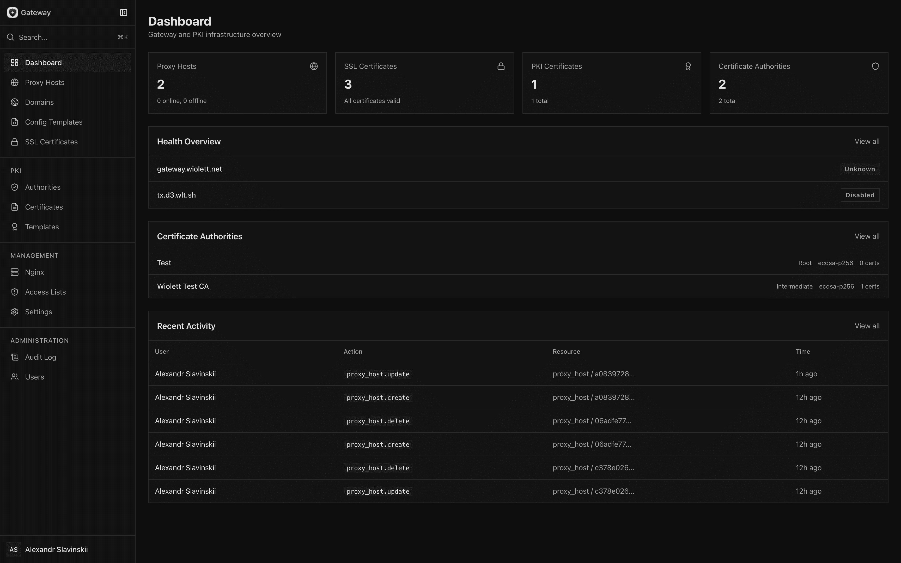
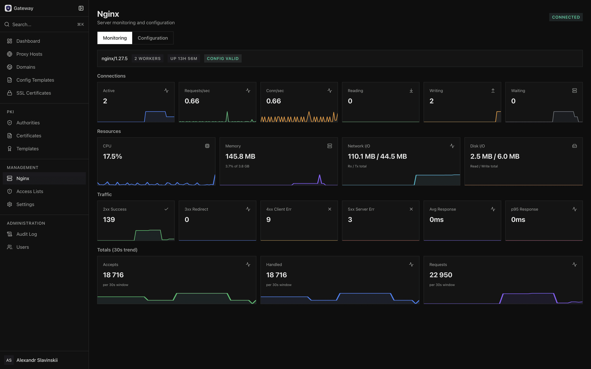
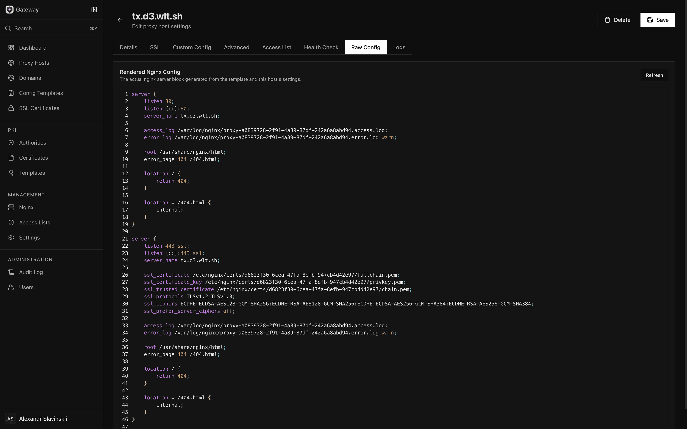
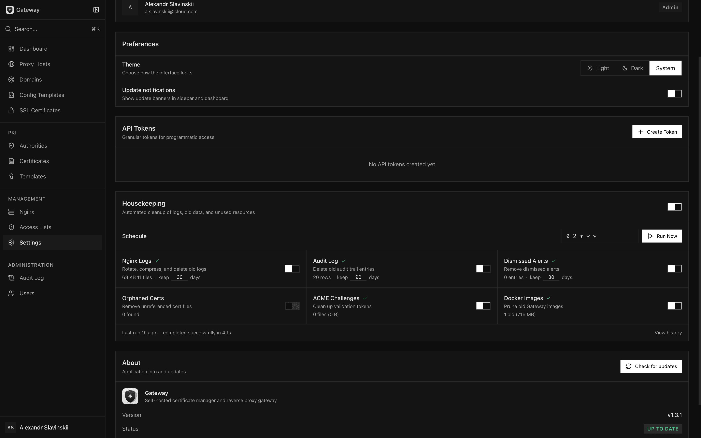

# Gateway

Self-hosted certificate manager and reverse proxy gateway.

> **Note:** The primary source of this project is [Wiolett GitLab](https://gitlab.wiolett.net/wiolett/gateway). The [GitHub repository](https://github.com/wiolett-industries/gateway) is a mirror for public visibility. Issues, feature requests, and pull requests are welcome on [GitHub](https://github.com/wiolett-industries/gateway/issues).

Gateway combines a full PKI (Certificate Authority) infrastructure with a reverse proxy manager — think Nginx Proxy Manager with a built-in CA. Issue and manage TLS certificates, configure proxy hosts, handle SSL termination, and monitor everything from a single interface.

## Screenshots

<table>
<tr>
<td align="center"><strong>Dashboard</strong></td>
<td align="center"><strong>Nginx Monitoring</strong></td>
</tr>
<tr>
<td></td>
<td></td>
</tr>
<tr>
<td align="center"><strong>Proxy Host Config</strong></td>
<td align="center"><strong>Settings</strong></td>
</tr>
<tr>
<td></td>
<td></td>
</tr>
</table>

## Features

**Reverse Proxy**
- Proxy hosts with SSL termination, WebSocket support, custom headers, rewrites
- Redirect and 404 host types
- Health checks with configurable expected status/body
- Drag-and-drop host ordering with folder organization
- Nginx config templates with variables
- Access lists (IP rules, basic auth)
- Real-time Nginx logs and stats monitoring

**PKI / Certificate Authority**
- Create root and intermediate CAs (RSA-2048/4096, ECDSA P-256/P-384)
- Issue TLS server, TLS client, code-signing, and email certificates
- Certificate templates with custom extensions and policies
- CRL distribution and OCSP responder built-in
- Certificate export (PEM, PKCS#12, JKS)

**SSL Management**
- Let's Encrypt (ACME) certificates with HTTP-01 and DNS-01 challenges
- Upload custom certificates
- Link internal PKI certificates to proxy hosts
- Auto-renewal with configurable schedule

**Domain Management**
- Central domain registry with DNS status tracking
- Automatic DNS validation (A/AAAA/CNAME/CAA/MX/TXT)
- Domain usage tracking across proxy hosts and SSL certificates

**AI Assistant** *(optional, disabled by default)*
- Natural language interface for all system operations — manage CAs, issue certificates, configure proxy hosts, and more through conversation
- Works with any OpenAI-compatible provider (OpenAI, Anthropic, local models, etc.)
- 30+ tools with destructive action approval flow and per-tool access control
- Asks clarifying questions with structured options before acting
- Built-in knowledge base the AI can query for system-specific context
- Web search integration (Tavily, Brave, Serper, Exa, or self-hosted SearXNG)
- Per-user approval bypass preferences, conversation save/restore, configurable rate limits
- Fully opt-in: enable in Settings > AI Assistant, configure a provider and API key. No data is sent anywhere until explicitly enabled by an admin.

**Administration**
- OIDC authentication (any OpenID Connect provider)
- Role-based access control (admin, operator, viewer, blocked)
- Granular API tokens with per-CA scoping
- Full audit log (AI-initiated actions flagged separately)
- Expiry alerts and notifications
- In-app updates with one-click self-update

## Quick Start

### Prerequisites

- Docker with Compose v2
- OpenSSL
- An OIDC provider (Keycloak, Authentik, Auth0, etc.)

### Install

```bash
mkdir gateway && cd gateway
curl -sSLO https://gitlab.wiolett.net/wiolett/gateway/-/raw/main/install.sh
bash install.sh
```

The installer walks you through configuration interactively — domain, OIDC settings, and optional SSL setup (Let's Encrypt or custom certificate).

### Install a specific version

```bash
bash install.sh --version v1.1.0
```

### Non-interactive install

```bash
bash install.sh -y \
  --domain gateway.example.com \
  --oidc-issuer https://id.example.com \
  --oidc-client-id gateway \
  --oidc-client-secret your-secret \
  --acme-email admin@example.com
```

With a custom (BYO) certificate:

```bash
bash install.sh -y \
  --domain gateway.example.com \
  --oidc-issuer https://id.example.com \
  --oidc-client-id gateway \
  --oidc-client-secret your-secret \
  --ssl-cert /path/to/cert.pem \
  --ssl-key /path/to/key.pem
```

All flags have environment variable alternatives (`GATEWAY_DOMAIN`, `GATEWAY_OIDC_ISSUER`, etc.). Run `bash install.sh --help` for the full list.

## Architecture

Gateway runs as four Docker containers:

| Service | Image | Purpose |
|---------|-------|---------|
| **app** | `gateway` | Node.js backend + frontend (Hono + React) |
| **nginx** | `nginx:1.27-alpine` | Reverse proxy, SSL termination |
| **postgres** | `postgres:16-alpine` | Database |
| **redis** | `redis:7-alpine` | Session cache, rate limiting |

The app container manages Nginx configuration dynamically via the Docker socket — when you create or update a proxy host, Gateway writes the Nginx config and reloads automatically.

## Updating

From the UI: **Settings > Check for updates > Update** (admin only). The app pulls the new image and recreates its own container automatically.

Manually:

```bash
# Edit .env: GATEWAY_VERSION=v1.1.0
docker compose pull && docker compose up -d
```

## Configuration

The installer generates a `.env` file with all settings. Key configuration options:

| Variable | Default | Description |
|----------|---------|-------------|
| `APP_URL` | `http://localhost:3000` | Public URL of the Gateway UI |
| `OIDC_ISSUER` | — | OIDC provider URL |
| `OIDC_CLIENT_ID` | — | OIDC client ID |
| `OIDC_CLIENT_SECRET` | — | OIDC client secret |
| `ACME_EMAIL` | `admin@example.com` | Let's Encrypt email |
| `ACME_STAGING` | `false` | Use Let's Encrypt staging |
| `HEALTH_CHECK_INTERVAL_SECONDS` | `30` | Proxy health check interval |
| `DNS_CHECK_INTERVAL_SECONDS` | `300` | Domain DNS check interval |
| `EXPIRY_WARNING_DAYS` | `30` | Days before expiry to warn |
| `EXPIRY_CRITICAL_DAYS` | `7` | Days before expiry for critical alert |
| `ACME_RENEWAL_CRON` | `0 3 * * *` | ACME renewal schedule |
| `UPDATE_CHECK_INTERVAL_HOURS` | `4` | How often to check for updates |

## Development

### Prerequisites

- Node.js >= 24
- pnpm >= 9
- Docker (for Postgres, Redis, Nginx)

### Setup

```bash
pnpm install
pnpm dev:infra        # Start Postgres, Redis, Nginx
pnpm db:migrate       # Run database migrations
pnpm dev:all          # Start backend + frontend dev servers
```

### Commands

| Command | Description |
|---------|-------------|
| `pnpm dev:all` | Start backend and frontend in parallel |
| `pnpm build` | Build both packages |
| `pnpm test` | Run backend tests |
| `pnpm lint` | Lint all packages |
| `pnpm db:generate` | Generate Drizzle ORM types |
| `pnpm db:migrate` | Run database migrations |
| `pnpm db:studio` | Open Drizzle Studio |

### Tech Stack

- **Backend:** Hono, Drizzle ORM, PostgreSQL, Redis, Node.js
- **Frontend:** React, Vite, Tailwind CSS, shadcn/ui
- **Infrastructure:** Docker, Nginx, Let's Encrypt (ACME)

## License

Licensed under the [PolyForm Small Business License 1.0.0](LICENSE.md).

- Free for personal use, nonprofits, and small businesses (<10 people, <$100K revenue)
- Larger commercial use requires a separate license — contact [contact@wiolett.net](mailto:contact@wiolett.net)
- Attribution required — retain all copyright notices and credits

Copyright (c) 2021-2026 [Wiolett](https://wiolett.net)
